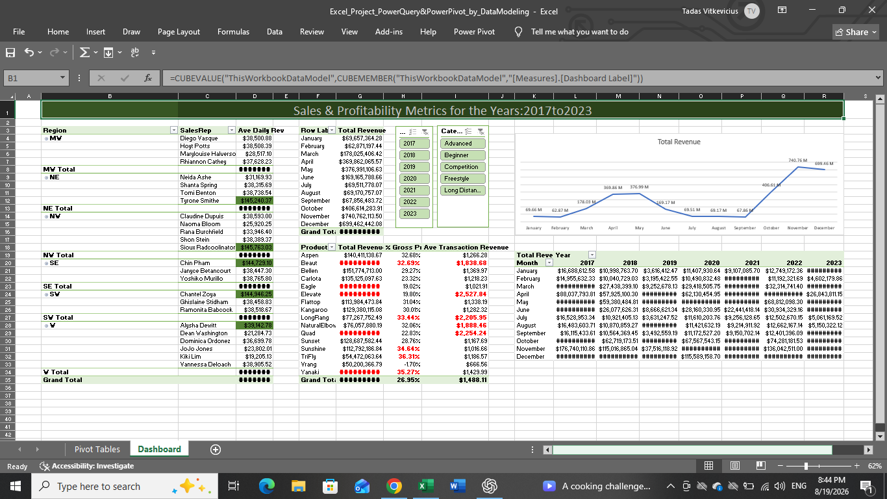
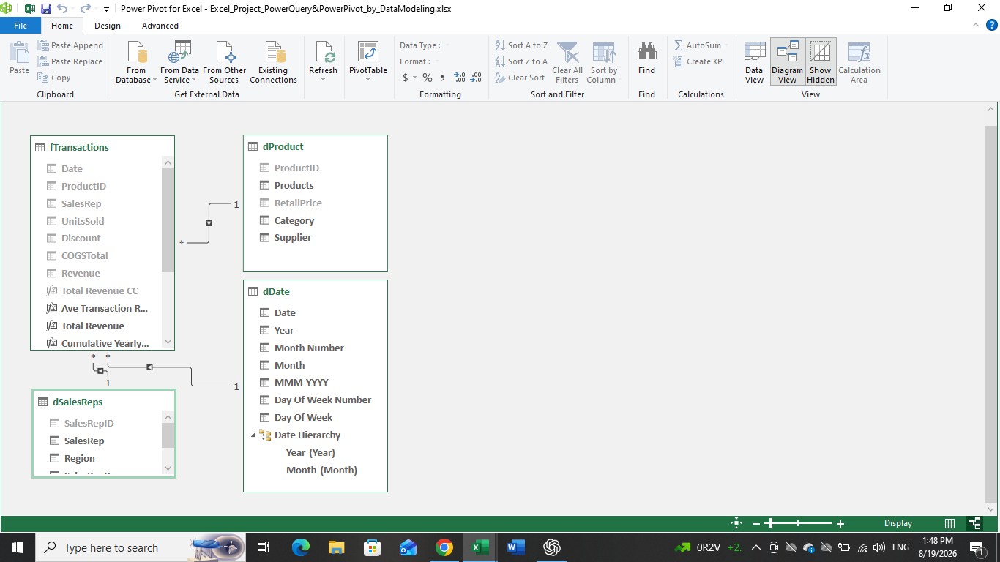
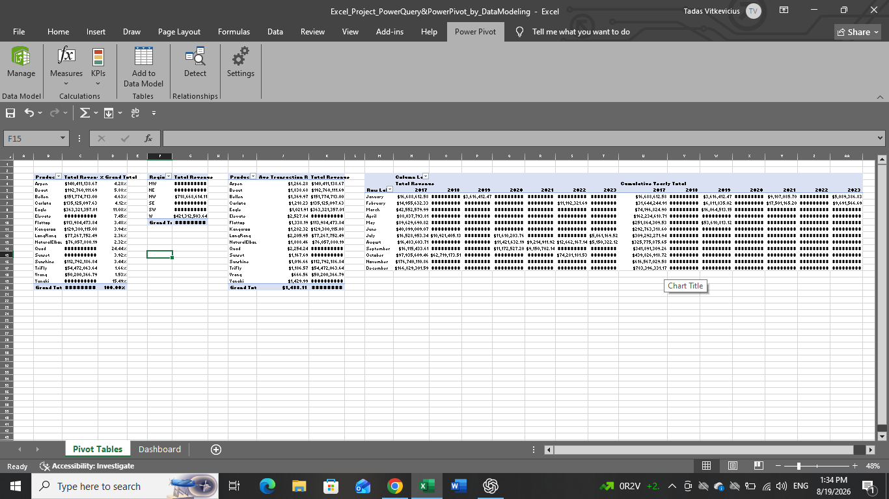

# Power Pivot & Power Query Analysis

## Project Overview

This project demonstrates how Microsoft Excel can be used to build a relational Data Model and perform business analysis using **Power Query and Power Pivot**.

The project focuses on preparing data, creating relationships between tables, building explicit measures, and analysing business performance through PivotTables.

## Project Objectives

The main objectives of this project were to:

- Import and transform data using **Power Query**
- Build a relational **Data Model**
- Create relationships between multiple tables
- Create and maintain a dedicated **Date Table**
- Create **explicit measures** in Power Pivot
- Analyse revenue, costs and profitability
- Use measures within PivotTables
- Develop a structured approach to data analysis

## Tools & Technologies

- **Microsoft Excel 2019**
- **Power Query**
- **Power Pivot**
- **Data Model**
- **Explicit Measures**
- **PivotTables**
- **Slicers**
- **PivotChart**
- **Dashboard**

## Data Model

The project uses a relational Data Model consisting of multiple tables.

The model includes:

- A **fact table** containing transactional data
- Supporting **dimension tables** for analysis

Relationships between the tables allow the data to be analysed dynamically through PivotTables and measures.

## Power Query

**Power Query** was used to import and prepare the source data.

The workflow includes:

- Importing data from source files
- Transforming data
- Combining data from multiple files
- Preparing tables for the Data Model
- Refreshing the model when new source data becomes available

This provides a repeatable data preparation process rather than manually updating individual tables.

## Explicit Measures

The project uses **explicit measures** created within Power Pivot, thet allows to extraxt data from data Model and apply it acordingly, rather then relying on Pivot Table creation from Data Table.

Examples include measures for:

- Total Revenue
- Total Cost
- Profit
- Average metrics
- % metrics

Explicit measures allow the calculations to be reused across different PivotTables and analysed dynamically according to the selected filters.

## Business Analysis

The Data Model allows business performance to be analysed across multiple dimensions, including:

- Revenue
- Costs
- Profitability
- Products
- Customers
- Time periods
- Other available business categories

PivotTables provide an interactive way to explore the results of the measures and relationships within the Data Model.

## Key Insights

- The Top 5 performers contribute the highest Total Daily Revenue across different Years and Categories.
- Daily Revenue is relatively consistent across Regions, despite differences in the number of contributors.
- Certain products contribute disproportionately to Total Revenue.
- Revenue and profitability show different patterns across time periods.
- Higher Average Transaction Revenue doesn't necesarily show the Highest Total Revenue.
- Total Revenue reveals a seasonal sales pattern, with growth toward January and a notable peak during spring.
- The Data Model allows performance to be analysed dynamically by different dimensions.

## Key Skills Demonstrated

This project demonstrates practical experience with:

- Power Query
- Power Pivot
- Data modelling
- Table relationships
- Data transformation
- Explicit measures
- Date Table modelling
- PivotTables
- Business KPI analysis
- Refreshable data workflows
- Structured data analysis

## Project in Action

### Interactive Dashboard

### Relationship between Data Tables

### PivotTable Analysis

